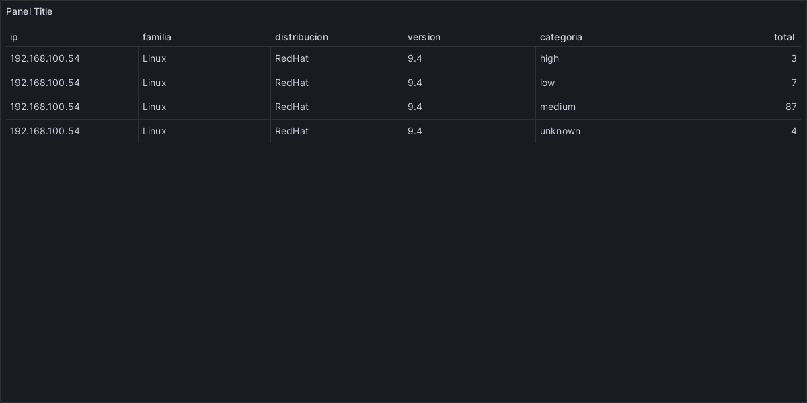

:doctype: book
:toc: left
:header-image: images/Betel_Tech_logo_final_high_quality.png
:header-image-width: 80
:header-image-position: left

= Informe de Evaluación de Betel Tech

== Resumen Ejecutivo

Este informe proporciona una visión general sobre la infraestructura gestionada por Betel Tech, con un enfoque en las métricas clave de los sistemas operativos, la seguridad y el soporte de los servidores.

=== Total de Servidores
La infraestructura cuenta con un número total de servidores distribuidos entre dos sistemas operativos principales. En la imagen se observa la proporción de servidores Linux frente a los servidores Windows, lo cual refleja la tendencia en el entorno de producción.

=== Distribución de Hosts por Sistema Operativo
En la imagen siguiente se visualiza cómo se distribuyen los servidores entre los sistemas operativos más utilizados. Esta información es clave para comprender la base tecnológica y el enfoque hacia los sistemas operativos en uso.

=== Cantidad de Pruebas Realizadas
El gráfico presentado muestra la cantidad total de pruebas de seguridad realizadas en los servidores, dividido por los sistemas operativos. Este análisis es esencial para evaluar la cobertura de las auditorías de seguridad y la atención a las configuraciones de cada entorno.

=== Total de Pruebas Fallidas
En la imagen correspondiente, se observan las pruebas de seguridad que no han superado los estándares establecidos. El desglose muestra las diferentes categorías de fallos en seguridad, lo que ayuda a identificar las áreas de mayor riesgo en la infraestructura.

=== Análisis de Soporte y Fechas de Vencimiento
El gráfico que se presenta ilustra las fechas de soporte y fin de soporte de los sistemas operativos. Esta información es crucial para la planificación de actualizaciones y la gestión de los riesgos asociados con el uso de versiones sin soporte.

=== Conclusión del Resumen Ejecutivo
El informe destaca la importancia de realizar un seguimiento constante de las pruebas de seguridad, especialmente en las áreas con mayor cantidad de fallos. Además, es crucial comenzar a planificar actualizaciones y migraciones antes de las fechas de fin de soporte de los sistemas operativos más antiguos.

== Detalle Completo del Informe

=== Métricas Detalladas

A continuación se presentan gráficos clave sobre la infraestructura de servidores, distribuciones, y vulnerabilidades.

==== Número de Hosts por Familia
El gráfico a continuación muestra el número total de hosts categorizados por sus respectivas familias. Esta información es crucial para entender la distribución de los sistemas en diferentes entornos operativos.

==== Número de Máquinas por Familia
El gráfico a continuación muestra el número de máquinas categorizadas por sus respectivas familias. Este desglose es útil para identificar la prevalencia de diferentes sistemas operativos en la infraestructura.

image::grafana_panel_additional_Panel_1.png[Número de Máquinas por Familia]

==== Total de Pruebas de Seguridad Realizadas
Este gráfico ilustra la cantidad total de pruebas de seguridad realizadas, segmentadas por sistema operativo.

==== Total de Pruebas Fallidas por Familia
A continuación se presenta el desglose de pruebas fallidas por familia, permitiendo identificar las áreas con más vulnerabilidades.

==== Espacio en Disco por Familia
Este gráfico ilustra el espacio en disco total disponible en diferentes familias de hosts. Una gestión adecuada del espacio en disco es esencial para garantizar la estabilidad del sistema.

=== Análisis Detallado de Vulnerabilidades

Para obtener más detalles sobre las vulnerabilidades detectadas por distribución y versión, consulte las siguientes imágenes. Estos gráficos proporcionan un desglose completo para cada combinación de familia, distribución y versión, permitiendo un enfoque más específico para abordar las vulnerabilidades.

image::python/Detalle_Vulnerabilidades_Windows_Windows_2022.png[Detalle de Vulnerabilidades Windows Windows 2022]

=== Análisis Detallado de Vulnerabilidades
include::python/high_vulnerabilities.adoc[]
include::python/medium_vulnerabilities.adoc[]
include::python/low_vulnerabilities.adoc[]

== Conclusión

Este informe destaca las métricas clave y vulnerabilidades presentes en su infraestructura. Los conocimientos proporcionados ayudarán a priorizar acciones para mejorar el rendimiento, la estabilidad y la seguridad del sistema. Cada sección de este informe está diseñada para guiarlo en la atención de las necesidades específicas de su entorno.

Por favor, póngase en contacto con Betel Tech para obtener más soporte y recomendaciones. Estamos aquí para ayudarlo a hacer que su infraestructura sea más segura, eficiente y confiable.
